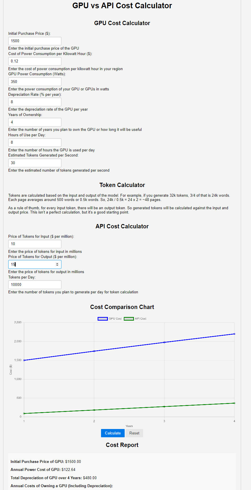
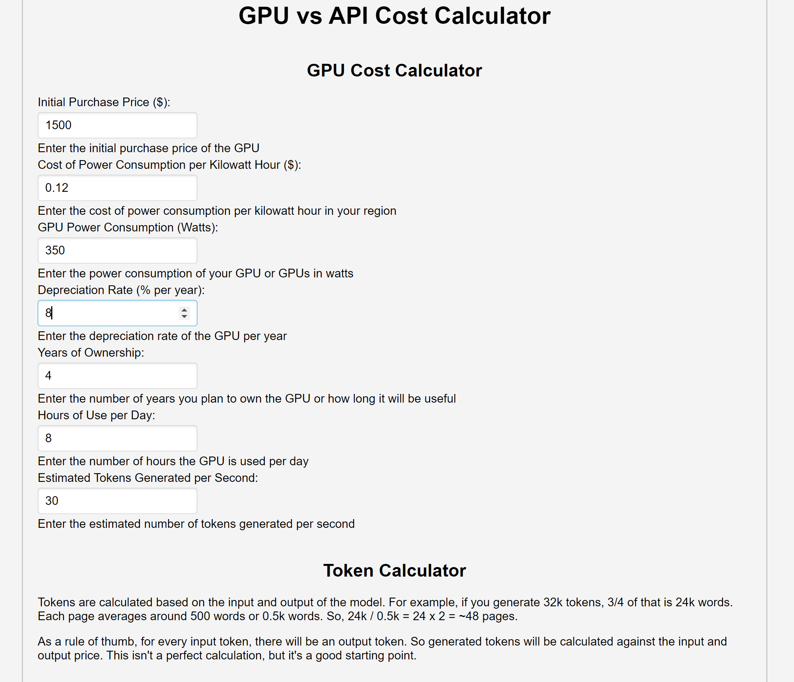
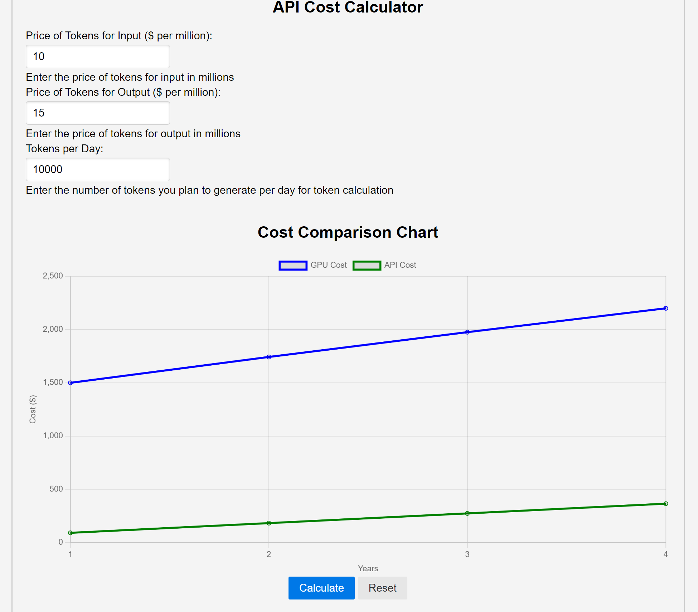
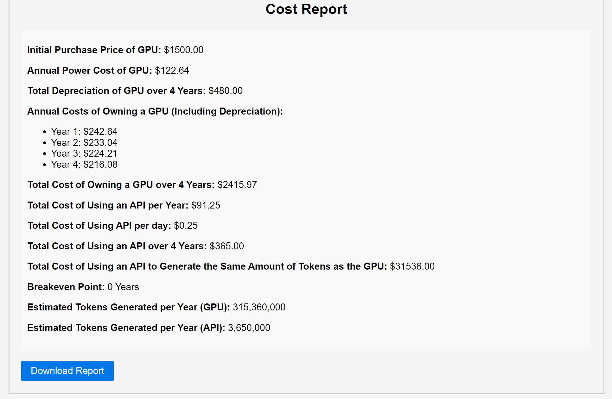

# GPU versus API

## Description

This project aims to compare the cost of buying a GPU versus the cost of using an API for Large Language Model (LLM) inference.

At the end of the day, this is very crude but it's a start and was immensely helpful for me to understand the cost of using an API for LLM inference for me.

If you like it, AWESOME... if not, sorry... I will try harder next time. :D

## Screenshots

<div style="display: flex; flex-wrap: wrap; justify-content: space-around;">
  <div style="flex: 1; text-align: center; margin: 10px;">
    
    <p>Screenshot 1</p>
  </div>
  <div style="flex: 1; text-align: center; margin: 10px;">
    
    <p>Screenshot 2</p>
  </div>
  <div style="flex: 1; text-align: center; margin: 10px;">
    
    <p>Screenshot 3</p>
  </div>
  <div style="flex: 1; text-align: center; margin: 10px;">
    
    <p>Screenshot 4</p>
  </div>
</div>

## Installation

1. Install `http-server` locally by running:

   ```shell
   npm install http-server
   npm install -g http-server
   ```

## Usage

1. Run the following command to start the HTTP server:

   ```shell
   ./run.sh
   ```

2. Open the web page in your default browser by visiting:

   ```shell
   http://localhost:8080
   ```

## Notes

- Make sure to have Node.js installed on your machine before running the script.
- Report / PDF download not working yet... my bad.
